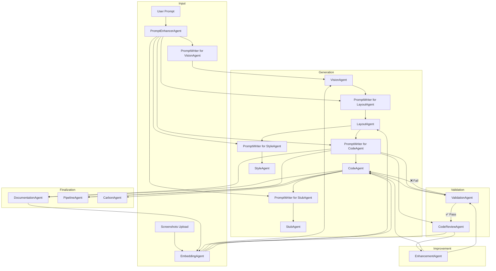

# 🧠 AI DevOps Agent Platform – Architecture Summary

## 🚀 Platform Overview

Transform legacy UI screenshots into modern Angular v20 applications through an intelligent multi-agent system. Upload a screenshot, describe your goals, and get production-ready code with CI/CD pipelines, documentation, and best practices built-in.

## ✅ User Journey

1. **Upload** → Legacy UI screenshot + project requirements
2. **Enhance** → AI enriches vague prompts with technical context
3. **Analyze** → Computer vision detects UI components and structure
4. **Design** → Generate semantic Angular layout (SCAM pattern, Signals)
5. **Style** → Apply SCSS themes and responsive design tokens
6. **Code** → Create TypeScript logic with reactive forms and OnPush
7. **Mock** → Generate service stubs and API endpoints
8. **Validate** → Automated build, test, and lint verification
9. **Review** → AI code review for UX/accessibility violations
10. **Enhance** → Self-healing improvements until quality passes
11. **Document** → Auto-generated README and usage guides
12. **Deploy** → CI/CD pipelines (GitHub Actions, Docker)
13. **Track** → Carbon footprint monitoring and embedding storage

## 🔁 Technical Architecture



## 🧠 Agent Capabilities & Responsibilities

### 🎯 Core Generation Agents
| Agent | Input | Output | Key Features |
|-------|-------|--------|--------------|
| **PromptEnhancerAgent** | Vague user prompts | Enhanced technical requirements | Context enrichment, tech stack inference, UX goal extraction |
| **VisionAgent** | UI screenshots | Structured component tree | Computer vision, layout detection, UI element classification |
| **LayoutAgent** | Component structure | Angular HTML templates | SCAM pattern, semantic markup, responsive design, accessibility |
| **StyleAgent** | Layout + design files | SCSS stylesheets | Design tokens, theme application, CSS best practices |
| **CodeAgent** | Layout + requirements | TypeScript logic | Reactive forms, OnPush strategy, Signals, dependency injection |
| **StubAgent** | Component requirements | Mock services | HTTP interceptors, data models, API stubs, testing utilities |

### 🔍 Quality Assurance Agents
| Agent | Purpose | Validation Criteria | Auto-fixes |
|-------|---------|-------------------|------------|
| **ValidationAgent** | Build verification | `ng build`, `ng test`, `ng lint` success | Compilation errors, test failures, linting violations |
| **CodeReviewAgent** | Code quality audit | Angular best practices, accessibility, performance | Anti-pattern detection, WCAG compliance, bundle optimization |
| **EnhancementAgent** | Iterative improvement | Self-healing until convergence | Code regeneration, architectural refactoring, optimization |

### 📋 Documentation & DevOps Agents
| Agent | Deliverable | Features | Integration |
|-------|-------------|----------|-------------|
| **DocumentationAgent** | Technical docs | README, API docs, usage examples, architecture diagrams | Component stories, deployment guides |
| **PipelineAgent** | CI/CD configuration | GitHub Actions, Docker, deployment scripts | Multi-environment, testing pipelines, security scanning |
| **CarbonAgent** | Sustainability metrics | CO₂ tracking per model run, optimization recommendations | Green coding practices, efficiency monitoring |
| **EmbeddingAgent** | Knowledge management | Semantic search, component reuse, context persistence | Cross-project learning, similarity matching |

### 🧩 Intelligent Prompting System
**PromptWriterAgent** generates context-aware, stage-specific prompts:

```python
# Dynamic prompt generation based on agent type and context
def generate_prompt(agent_type, context, artifacts):
    if agent_type == "VisionAgent":
        return f"Analyze uploaded screenshot: detect {context.ui_elements}, extract layout hierarchy"
    elif agent_type == "LayoutAgent":
        return f"Generate Angular 20 HTML using {context.vision_output}, apply {context.design_system}"
    elif agent_type == "CodeAgent":
        return f"Create standalone component with {context.layout_structure}, implement {context.business_logic}"
```

## 🎯 Platform Advantages

- **🚀 Speed**: Legacy UI → Production code in minutes
- **🧠 Intelligence**: Context-aware prompting across all stages
- **🔄 Self-Healing**: Automatic error detection and correction
- **📱 Modern Stack**: Angular v20, Signals, SCAM pattern, OnPush
- **♿ Accessibility**: Built-in WCAG compliance and best practices
- **🌱 Sustainable**: Carbon footprint tracking and optimization
- **📦 Production-Ready**: Full CI/CD, documentation, and deployment configs
- **🔗 Reusable**: Component library building through semantic embeddings

## 🧩 Use Cases

| Scenario | Platform Response | Business Value |
|----------|------------------|----------------|
| Legacy system modernization | Full Angular migration with preserved functionality | Reduced technical debt, improved maintainability |
| Rapid prototyping | Screenshot → Working prototype in minutes | Faster time-to-market, stakeholder validation |
| Design system implementation | Consistent components across projects | Brand consistency, development efficiency |
| Accessibility compliance | WCAG-compliant code generation | Legal compliance, inclusive user experience |
| Team productivity | Automated documentation and testing | Reduced manual work, higher code quality |
- 📋 Ensure code review + UX best practices
- 📦 Create docs + pipeline
- 🔁 Embed all outputs for learning, reuse, linking
- 🌱 Track carbon emissions per model run
- 🔁 Self-healing loop: Enhancements automatically revalidated to ensure convergence

---

## 🧩 Use Cases Enabled

| User Action | System Behavior |
|-------------|-----------------|
| "Modernize this UI" + screenshot | Full Angular code is generated |
| Prompt is vague | PromptEnhancer expands it |
| Build fails | ValidationAgent triggers retry |
| Review fails | EnhancementAgent proposes fixes |
| Want to reuse components | EmbeddingAgent matches similar ones |
| Need GitHub CI | PipelineAgent generates config |
| Need docs | DocumentationAgent adds README, usage |
| Build and review fail | EnhancementAgent regenerates and revalidates until it passes |
