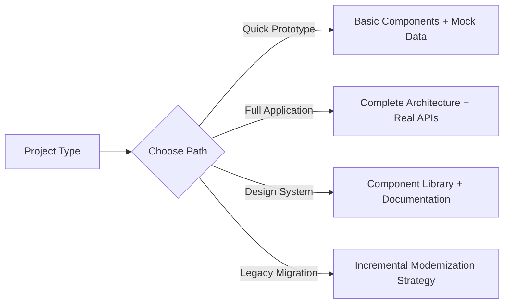
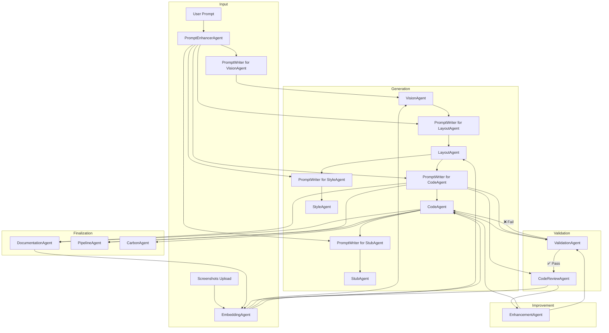

# 🧠 AI DevOps Agent Platform – Architecture Summary

## 🚀 Platform Overview

Transform legacy UI screenshots into modern Angular v20 applications through an intelligent multi-agent system. Upload a screenshot, describe your goals, and get production-ready code with CI/CD pipelines, documentation, and best practices built-in.

## 🚀 Project Onboarding & Setup

### 📋 New Project Wizard

Our intelligent onboarding system guides you through project creation with a step-by-step wizard:

#### 1. **Project Details**
```yaml
Project Configuration:
  - Project Name: "My Modernized App"
  - Target Framework: Angular v20 (default)
  - Architecture Pattern: SCAM (Standalone Components)
  - State Management: Signals + OnPush
  - Build Tool: Angular CLI + Vite
  - Testing Framework: Jest + Testing Library
```

#### 2. **File Upload Center**
| Upload Type | Supported Formats | Purpose | AI Processing |
|-------------|------------------|---------|---------------|
| **UI Screenshots** | PNG, JPG, WebP | Legacy UI analysis | Computer vision extraction |
| **Design Assets** | Figma, Sketch, Adobe XD | Design system reference | Layout pattern detection |
| **CSS/SCSS Files** | .css, .scss, .sass | Existing theme import | Style token extraction |
| **Brand Assets** | PNG, SVG (logos, icons) | Brand consistency | Asset optimization |
| **Project Documents** | PDF, DOC, MD | Requirements analysis | Context understanding |
| **API Specs** | JSON, YAML (OpenAPI) | Service generation | Type-safe client creation |
| **Confluence Links** | URLs to Confluence pages | Documentation integration | Content scraping, requirement extraction, team knowledge sync |

#### 3. **Theme & Design System Setup**

**Option A: Upload Existing CSS/SCSS**
```scss
// Your existing theme will be analyzed for:
$primary-color: #007bff;
$secondary-color: #6c757d;
$font-family: 'Inter', sans-serif;
$border-radius: 8px;
$spacing-unit: 16px;

// AI extracts design tokens automatically
```

**Option B: Theme Customization Wizard**
```yaml
Brand Preferences:
  Primary Color: "#007bff" | Color Picker
  Secondary Color: "#6c757d" | Color Picker  
  Typography: "Modern Sans" | "Classic Serif" | "Tech Mono"
  Layout Density: "Compact" | "Comfortable" | "Spacious"
  Border Style: "Rounded" | "Sharp" | "Soft"
  Animation Level: "Minimal" | "Moderate" | "Rich"
```

**Option C: AI-Generated Theme Templates**
| Template | Description | Use Case | Preview |
|----------|-------------|----------|---------|
| **Corporate Blue** | Professional, trustworthy, enterprise-ready | Business applications, dashboards | 🔵 |
| **Modern Minimalist** | Clean lines, white space, subtle shadows | SaaS platforms, productivity tools | ⚪ |
| **Dark Professional** | Dark mode, high contrast, developer-friendly | Development tools, analytics | ⚫ |
| **Vibrant Creative** | Bold colors, gradients, playful interactions | Marketing sites, creative portfolios | 🌈 |
| **Healthcare Clean** | Calming blues/greens, accessible, medical-grade | Healthcare applications, wellness | 💚 |
| **Financial Trust** | Conservative colors, data-focused, secure feeling | Banking, finance, investment tools | 💼 |

#### 4. **Project Journey Configuration**

**Development Path Selection:**


**Quality & Compliance Settings:**
- ✅ **Accessibility**: WCAG 2.1 AA compliance
- ✅ **Performance**: Lighthouse score targets (90+)
- ✅ **Security**: OWASP best practices
- ✅ **Testing**: Unit (80%+) + E2E coverage
- ✅ **Documentation**: Auto-generated + interactive examples

#### 5. **AI-Powered Project Intelligence**

Based on your uploads and preferences, our AI will:

```python
# Project Analysis Engine
def analyze_project_context(uploads, preferences):
    return {
        "detected_patterns": extract_ui_patterns(screenshots),
        "design_tokens": parse_css_variables(stylesheets),
        "component_library": suggest_components(requirements),
        "architecture_recommendations": analyze_complexity(documents),
        "performance_targets": calculate_benchmarks(project_type),
        "deployment_strategy": recommend_hosting(scale_requirements)
    }
```

### 🎨 Live Theme Preview

During onboarding, see your choices applied in real-time:
- **Component Previews**: Buttons, forms, cards with your theme
- **Layout Examples**: Dashboard, list view, detail page mockups  
- **Responsive Breakpoints**: Mobile, tablet, desktop views
- **Accessibility Check**: Color contrast, focus states, screen reader compatibility

### 📱 Onboarding Output

After completing the wizard, you receive:
1. **Project Configuration File** (angular.json, package.json, tsconfig.json)
2. **Design System Starter** (SCSS variables, mixins, component themes)
3. **Component Templates** (Based on uploaded screenshots)
4. **Development Roadmap** (Prioritized feature list with time estimates)
5. **Quality Gates** (Automated testing and review checkpoints)

## ✅ User Journey

1. **Upload** → Legacy UI screenshot + project requirements
2. **Enhance** → AI enriches vague prompts with technical context
3. **Analyze** → Computer vision detects UI components and structure
4. **Design** → Generate semantic Angular layout (SCAM pattern, Signals)
5. **Style** → Apply SCSS themes and responsive design tokens
6. **Code** → Create TypeScript logic with reactive forms and OnPush
7. **Mock** → Generate service stubs and API endpoints
8. **Validate** → Automated build, test, and lint verification
9. **Review** → AI code review for UX/accessibility violations
10. **Enhance** → Self-healing improvements until quality passes
11. **Document** → Auto-generated README and usage guides
12. **Deploy** → CI/CD pipelines (GitHub Actions, Docker)
13. **Track** → Carbon footprint monitoring and embedding storage

## 🔁 Technical Architecture



## 🧠 Agent Capabilities & Responsibilities

### 🎯 Core Generation Agents
| Agent | Input | Output | Key Features |
|-------|-------|--------|--------------|
| **PromptEnhancerAgent** | Vague user prompts | Enhanced technical requirements | Context enrichment, tech stack inference, UX goal extraction |
| **VisionAgent** | UI screenshots | Structured component tree | Computer vision, layout detection, UI element classification |
| **LayoutAgent** | Component structure | Angular HTML templates | SCAM pattern, semantic markup, responsive design, accessibility |
| **StyleAgent** | Layout + design files | SCSS stylesheets | Design tokens, theme application, CSS best practices |
| **CodeAgent** | Layout + requirements | TypeScript logic | Reactive forms, OnPush strategy, Signals, dependency injection |
| **StubAgent** | Component requirements | Mock services | HTTP interceptors, data models, API stubs, testing utilities |

### 🔍 Quality Assurance Agents
| Agent | Purpose | Validation Criteria | Auto-fixes |
|-------|---------|-------------------|------------|
| **ValidationAgent** | Build verification | `ng build`, `ng test`, `ng lint` success | Compilation errors, test failures, linting violations |
| **CodeReviewAgent** | Code quality audit | Angular best practices, accessibility, performance | Anti-pattern detection, WCAG compliance, bundle optimization |
| **EnhancementAgent** | Iterative improvement | Self-healing until convergence | Code regeneration, architectural refactoring, optimization |

### 📋 Documentation & DevOps Agents
| Agent | Deliverable | Features | Integration |
|-------|-------------|----------|-------------|
| **DocumentationAgent** | Technical docs | README, API docs, usage examples, architecture diagrams | Component stories, deployment guides |
| **PipelineAgent** | CI/CD configuration | GitHub Actions, Docker, deployment scripts | Multi-environment, testing pipelines, security scanning |
| **CarbonAgent** | Sustainability metrics | CO₂ tracking per model run, optimization recommendations | Green coding practices, efficiency monitoring |
| **EmbeddingAgent** | Knowledge management | Semantic search, component reuse, context persistence | Cross-project learning, similarity matching |

### 🧩 Intelligent Prompting System
**PromptWriterAgent** generates context-aware, stage-specific prompts:

```python
# Dynamic prompt generation based on agent type and context
def generate_prompt(agent_type, context, artifacts):
    if agent_type == "VisionAgent":
        return f"Analyze uploaded screenshot: detect {context.ui_elements}, extract layout hierarchy"
    elif agent_type == "LayoutAgent":
        return f"Generate Angular 20 HTML using {context.vision_output}, apply {context.design_system}"
    elif agent_type == "CodeAgent":
        return f"Create standalone component with {context.layout_structure}, implement {context.business_logic}"
```

## 🎯 Platform Advantages

- **🚀 Speed**: Legacy UI → Production code in minutes
- **🧠 Intelligence**: Context-aware prompting across all stages
- **🔄 Self-Healing**: Automatic error detection and correction
- **📱 Modern Stack**: Angular v20, Signals, SCAM pattern, OnPush
- **♿ Accessibility**: Built-in WCAG compliance and best practices
- **🌱 Sustainable**: Carbon footprint tracking and optimization
- **📦 Production-Ready**: Full CI/CD, documentation, and deployment configs
- **🔗 Reusable**: Component library building through semantic embeddings

## 🧩 Use Cases

| Scenario | Platform Response | Business Value |
|----------|------------------|----------------|
| Legacy system modernization | Full Angular migration with preserved functionality | Reduced technical debt, improved maintainability |
| Rapid prototyping | Screenshot → Working prototype in minutes | Faster time-to-market, stakeholder validation |
| Design system implementation | Consistent components across projects | Brand consistency, development efficiency |
| Accessibility compliance | WCAG-compliant code generation | Legal compliance, inclusive user experience |
| Team productivity | Automated documentation and testing | Reduced manual work, higher code quality |
