# 🧠 AI DevOps Agent Platform – Architecture Summary

## 🔁 Execution Flow

```mermaid
graph TD
    A[User Prompt] --> M[PromptEnhancerAgent]
    M --> A1[Screenshots Upload]
    A1 --> B[VisionAgent]
    B --> C[LayoutAgent]
    C --> D[CodeAgent]
    D --> E[StyleAgent]
    D --> F[StubAgent]

    %% Validation comes after core code
    D --> G[ValidationAgent]

    %% Build passed
    G -->|✅ Pass| H[CodeReviewAgent]
    %% Build failed
    G -->|❌ Fail| D

    %% Code review feedback
    H --> I[EnhancementAgent]
    I --> D

    %% Parallel flows from improved code
    D --> J[DocumentationAgent]
    D --> K[PipelineAgent]
    D --> L[CarbonAgent]

    %% Embedding layer collects everything
    D --> N[EmbeddingAgent]
    J --> N
    H --> N
```

---

## 🧠 Agent Role Summary

| Agent | Description |
|-------|-------------|
| **PromptEnhancerAgent** | Enriches vague prompts with context (design goals, UX intent, architecture hints) |
| **VisionAgent** | Parses screenshots into structured UI elements |
| **LayoutAgent** | Translates UI trees into Angular-compatible layout (HTML) |
| **CodeAgent** | Generates Angular TS/HTML/SCSS following best practices |
| **StyleAgent** | Applies SCSS/themes from uploaded files or inferred design |
| **StubAgent** | Creates service stubs and mock HTTP endpoints |
| **ValidationAgent** | Runs `ng build`, `ng test`, `ng lint` and parses errors |
| **CodeReviewAgent** | Flags UI/UX violations, Angular antipatterns, accessibility issues |
| **EnhancementAgent** | Recommends improvements and re-generates code if necessary |
| **DocumentationAgent** | Writes README, docstrings, and usage guides for all components |
| **PipelineAgent** | Generates GitHub Actions, Dockerfiles, and CI/CD configs |
| **CarbonAgent** | Tracks estimated CO₂ per model/token run |
| **EmbeddingAgent** | Stores semantic representations of all code, styles, and docs for reuse, similarity search, and linkage |

---

## 🎯 System Goals

- ✅ Generate clean Angular v20 code from legacy screenshots
- 🧠 Automatically enhance vague instructions into actionable prompts
- 🧪 Validate builds + test output
- 📋 Ensure code review + UX best practices
- 📦 Create docs + pipeline
- 🔁 Embed all outputs for learning, reuse, linking
- 🌱 Track carbon emissions per model run

---

## 🧩 Use Cases Enabled

| User Action | System Behavior |
|-------------|-----------------|
| "Modernize this UI" + screenshot | Full Angular code is generated |
| Prompt is vague | PromptEnhancer expands it |
| Build fails | ValidationAgent triggers retry |
| Review fails | EnhancementAgent proposes fixes |
| Want to reuse components | EmbeddingAgent matches similar ones |
| Need GitHub CI | PipelineAgent generates config |
| Need docs | DocumentationAgent adds README, usage |
