# 🧠 AI DevOps Agent Platform – Architecture Summary

## 🔁 Execution Flow

```mermaid
flowchart TD
    subgraph Input
        A[User Prompt] --> M[PromptEnhancerAgent]
        M --> PW1[PromptWriter for VisionAgent]
        M --> PW2[PromptWriter for LayoutAgent]
        M --> PW3[PromptWriter for CodeAgent]
        M --> PW4[PromptWriter for StyleAgent]
        M --> PW5[PromptWriter for StubAgent]
        A1[Screenshots Upload] --> N[EmbeddingAgent]
    end

    subgraph Generation
        PW1 --> B[VisionAgent]
        PW2 --> C[LayoutAgent]
        PW3 --> D[CodeAgent]
        PW4 --> E[StyleAgent]
        PW5 --> F[StubAgent]
    end

    subgraph Validation
        D --> G[ValidationAgent]
        PW3 --> G
        G -->|✅ Pass| H[CodeReviewAgent]
        G -->|❌ Fail| D
    end

    subgraph Improvement
        PW3 --> H[CodeReviewAgent]
        H --> I[EnhancementAgent]
        I --> D
    end

    subgraph Finalization
        PW3 --> J[DocumentationAgent]
        PW3 --> K[PipelineAgent]
        D --> J
        D --> K
        D --> L[CarbonAgent]
    end

    %% Embedding Agent informs core stages
    N --> B
    N --> C
    N --> D
    J --> N
    H --> N

    %% Feedback Loop (Self-Healing Build)
    I --> G
```



### 🧠 Prompt Flow

PromptWriterAgent receives:
- The **original user prompt** (e.g. "Modernize this screen")
- Context from **PromptEnhancerAgent** (tech stack, layout goals, etc.)
- Target **agent stage** (e.g. LayoutAgent)

It outputs stage-specific prompts like:

```yaml
prompt_for_LayoutAgent: >
  Using the goal of modernizing a data transfer UI into Angular 20, generate a semantic layout that uses standalone components, responsive tab structure, and follows SCAM pattern.

prompt_for_CodeAgent: >
  Generate TypeScript logic and bind forms, events, and mock data according to layout. Apply OnPush strategy.
```

### 🔁 Per-Agent Prompting Strategy

PromptWriterAgent is invoked at each stage to produce context-aware, agent-specific prompts.

Example logic:

```python
def generate_prompt(agent_type, context):
    if agent_type == "VisionAgent":
        return f"From the uploaded screenshot, detect and label UI components like tabs, tables, buttons."
    elif agent_type == "LayoutAgent":
        return f"Using the detected UI structure, generate Angular 20 HTML layout using SCAM pattern and semantic tags."
    elif agent_type == "CodeAgent":
        return f"Create a standalone Angular component with TS logic and reactive forms. Follow OnPush and Signals best practices."
    elif agent_type == "StyleAgent":
        return f"Apply the given SCSS theme to the HTML structure, using design tokens and color palette."
```

This ensures prompts are adaptive and purpose-built for each agent.

---

## 🧠 Agent Role Summary

| Agent | Description |
|-------|-------------|
| **PromptEnhancerAgent** | Enriches vague prompts with context (design goals, UX intent, architecture hints) |
| **PromptWriterAgent** | Generates prompts dynamically for each agent stage (e.g., VisionAgent, LayoutAgent, CodeAgent) based on agent type, upstream context, enhanced user intent, and user-uploaded artifacts. Ensures each LLM invocation is precisely tailored and context-aware. |
| **VisionAgent** | Parses screenshots into structured UI elements |
| **LayoutAgent** | Translates UI trees into Angular-compatible layout (HTML) |
| **CodeAgent** | Generates Angular TS/HTML/SCSS following best practices |
| **StyleAgent** | Applies SCSS/themes from uploaded files or inferred design |
| **StubAgent** | Creates service stubs and mock HTTP endpoints |
| **ValidationAgent** | Runs `ng build`, `ng test`, `ng lint` and parses errors |
| **CodeReviewAgent** | Flags UI/UX violations, Angular antipatterns, accessibility issues |
| **EnhancementAgent** | Recommends improvements and re-generates code if necessary. Automatically triggers validation after re-generation to ensure fix quality. |
| **DocumentationAgent** | Writes README, docstrings, and usage guides for all components |
| **PipelineAgent** | Generates GitHub Actions, Dockerfiles, and CI/CD configs |
| **CarbonAgent** | Tracks estimated CO₂ per model/token run |
| **EmbeddingAgent** | Ingests all uploaded screenshots and generated artifacts early in the flow. Enables semantic memory across agents for UI, code reuse, and layout consistency. |

---

## 🎯 System Goals

- ✅ Generate clean Angular v20 code from legacy screenshots
- 🧠 Automatically enhance vague instructions into actionable prompts
- 🧪 Validate builds + test output
- 📋 Ensure code review + UX best practices
- 📦 Create docs + pipeline
- 🔁 Embed all outputs for learning, reuse, linking
- 🌱 Track carbon emissions per model run
- 🔁 Self-healing loop: Enhancements automatically revalidated to ensure convergence

---

## 🧩 Use Cases Enabled

| User Action | System Behavior |
|-------------|-----------------|
| "Modernize this UI" + screenshot | Full Angular code is generated |
| Prompt is vague | PromptEnhancer expands it |
| Build fails | ValidationAgent triggers retry |
| Review fails | EnhancementAgent proposes fixes |
| Want to reuse components | EmbeddingAgent matches similar ones |
| Need GitHub CI | PipelineAgent generates config |
| Need docs | DocumentationAgent adds README, usage |
| Build and review fail | EnhancementAgent regenerates and revalidates until it passes |
